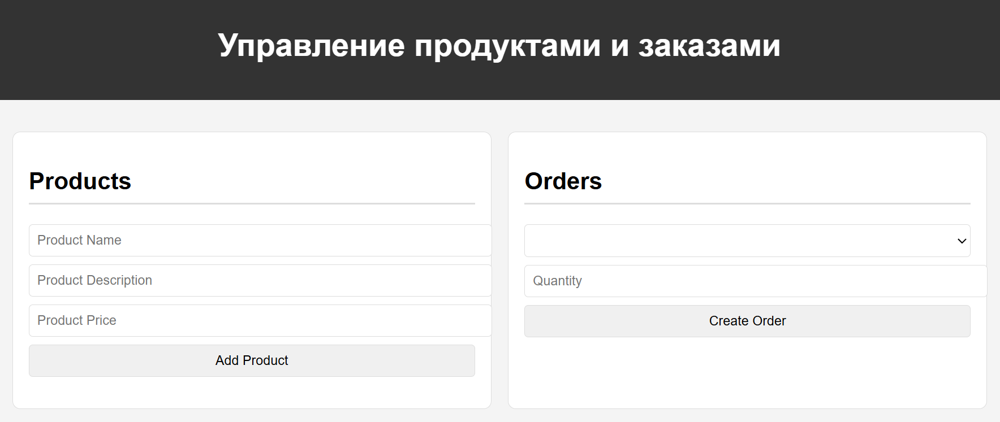

## Описание структуры

### `multi-module-project/pom.xml`

- **Основной файл POM** для всего проекта. Включает модули для `product-service`, `order-service` и `notification-service`.

  
### `product-service/`

- **ProductServiceApplication.java**: Главный класс Spring Boot для запуска сервиса управления продуктами.

- **model/Product.java**: Класс-сущность для продукта.

- **repository/ProductRepository.java**: Репозиторий для доступа к данным продуктов.

- **service/ProductService.java**: Сервисный слой для бизнес-логики продуктов.

- **controller/ProductController.java**: REST-контроллер для управления продуктами.

- **static/index.html**: Главная страница веб-приложения.

- **static/styles.css**: Стили для веб-приложения.

- **static/script.js**: Скрипты для веб-приложения.

- **application.properties**: Конфигурационные свойства для `product-service`.

### `order-service/`

- **OrderServiceApplication.java**: Главный класс Spring Boot для запуска сервиса управления заказами.

- **model/Order.java**: Класс-сущность для заказа.

- **repository/OrderRepository.java**: Репозиторий для доступа к данным заказов.

- **service/OrderService.java**: Сервисный слой для бизнес-логики заказов.

- **controller/OrderController.java**: REST-контроллер для управления заказами.

- **application.properties**: Конфигурационные свойства для `order-service`.

### `notification-service/`

- **NotificationServiceApplication.java**: Главный класс Spring Boot для запуска сервиса уведомлений.

- **controller/NotificationController.java**: REST-контроллер для отправки уведомлений.

- **application.properties**: Конфигурационные свойства для `notification-service`.

## Запуск микросервисов

1. **Запуск PostgreSQL и создание баз данных**:

    - Создание базы данных `productdb`, `orderdb`, `notificationdb` в PostgreSQL.

  
## Пользовательский интерфейс

